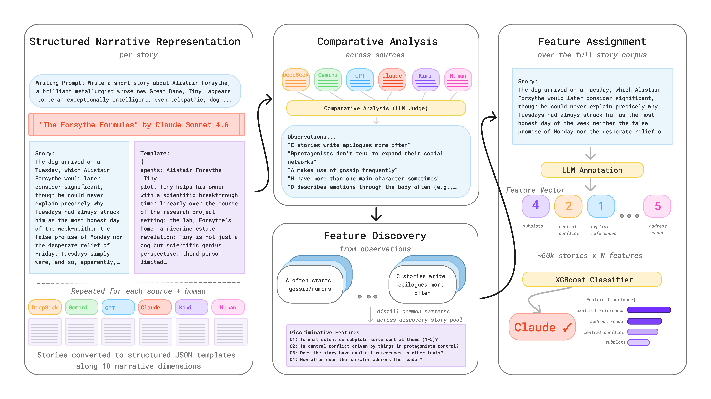

# StoryScope: Investigating idiosyncrasies in AI fiction

*Jenna Russell, Rishanth Rajendhran, Chau Minh Pham, Mohit Iyyer, John Wieting*   
University of Maryland, Google DeepMind

[](https://arxiv.org/abs/2604.03136)

Paper: [StoryScope: Investigating idiosyncrasies in AI fiction](https://arxiv.org/abs/2604.03136)


## Overview

StoryScope is a pipeline that automatically induces a fine-grained, interpretable feature space of discourse-level narrative features across 10 dimensions (plot, agents, temporal structure, etc.). We apply StoryScope to a parallel corpus of 10,272 writing prompts, each written by a human author and five LLMs, yielding 61,608 stories (~5,000 words each) and 304 extracted features per story.

**Results:**
- Narrative features alone achieve **93.2% macro-F1** for human-vs-AI detection and **68.4% macro-F1** for 6-way authorship attribution
- A compact set of **30 core features** captures much of this signal
- AI-generated stories cluster in a shared region of narrative space, while human-authored stories exhibit greater diversity. 

## Pipeline

<p align="center">
  
</p>

<!-- | Stage | Script | Description |
|-------|--------|-------------|
| 1 | `storyscope.1_story_generation.generate_stories` | Generate AI stories from writing prompts |
| 2 | `storyscope.2_template_extraction.extract_templates` | Extract NarraBench-structured narrative templates |
| 3 | `storyscope.3_cross_source_comparison.compare_sources` | Compare templates across sources (blinded) |
| 4a | `storyscope.4_feature_discovery.discover_features` | Discover discriminative features per dimension |
| 4b | `storyscope.4_feature_discovery.build_taxonomy` | Merge discovery runs into union taxonomy |
| 4c | `storyscope.4_feature_discovery.cluster_features` | Deduplicate features via embedding clustering |
| 5 | `storyscope.5_feature_application.apply_features` | Apply taxonomy to stories (10 calls/story) |
| 6a | `storyscope.6_classification.train_classifier` | Train XGBoost classifiers (binary + 6-way) |
| 6b | `storyscope.6_classification.shap_analysis` | Bootstrap SHAP for feature importance & roles | -->

## Installation

```bash
git clone https://github.com/jenna-russell/storyscope.git
cd storyscope
pip install -r requirements.txt
```

## Data

See [`data/README.md`](data/README.md) for detailed documentation.

| File | Description | Size |
|------|-------------|------|
| `data/stories_dev.parquet` | Dev set stories (100 prompts, included in repo) | 7.5 MB |
| `data/storyscope_features.parquet` | 304 features x 61,575 stories | 7.3 MB |
| `data/taxonomy.json` | Feature taxonomy (304 features, 10 dimensions) | 279 KB |
| `data/models/` | Trained XGBoost weights (binary + multiclass) | 22 MB |

**Full dataset hosting:** The complete story splits and data artifacts are hosted externally due to file size limits.

- Hugging Face: <https://huggingface.co/datasets/jjrussell10/storyscope>
- Google Drive: <https://drive.google.com/drive/folders/1o8RC6Crf6vnoL79BDcqON8xsZvGOsxSx?usp=sharing>

**Note:** Human story text is excluded due to copyright (sourced from Books3). The dataset includes book metadata (author, anthology, word count) and all AI-generated stories.

## Configuration

StoryScope uses a config-driven provider system supporting **OpenAI**, **Anthropic (Claude)**, **Google Vertex AI (Gemini)**, and **local HuggingFace models**.

Edit `config/models.yaml` to set your preferred provider per pipeline stage:

```yaml
pipeline:
  story_generation:
    provider: openai          # openai, anthropic, vertex, or huggingface
    model: gpt-5.4
  feature_application:
    provider: vertex
    model: gemini-3-flash
```

Set the required API key environment variables:
```bash
export OPENAI_API_KEY="sk-..."
export ANTHROPIC_API_KEY="sk-ant-..."
export GOOGLE_CLOUD_PROJECT="my-project-id"  # for Vertex AI
```

## Quick Start

```bash
# Generate stories from prompts
python -m storyscope.1_story_generation.generate_stories \
    --prompts data/prompts.json --output-dir outputs/stories --parallel 4

# Extract structured templates
python -m storyscope.2_template_extraction.extract_templates \
    --csv data/stories_dev.parquet --output-dir outputs/templates --parallel 4

# Compare sources (blinded)
python -m storyscope.3_cross_source_comparison.compare_sources \
    --templates-dir outputs/templates --output-dir outputs/comparisons --parallel 4

# Discover features (3 runs for stability)
python -m storyscope.4_feature_discovery.discover_features \
    --comparisons-dir outputs/comparisons --output-dir outputs/taxonomy --runs 3

# Build union taxonomy and deduplicate
python -m storyscope.4_feature_discovery.build_taxonomy \
    --input-dir outputs/taxonomy --output outputs/taxonomy/union_taxonomy.json

python -m storyscope.4_feature_discovery.cluster_features \
    --taxonomy outputs/taxonomy/union_taxonomy.json \
    --output-dir outputs/taxonomy/clustered --sim-threshold 0.85

# Apply features to stories
python -m storyscope.5_feature_application.apply_features \
    --csv data/stories_train.parquet --taxonomy data/taxonomy.json \
    --output-dir outputs/features --parallel 24

# Train classifiers
python -m storyscope.6_classification.train_classifier \
    --features data/storyscope_features.parquet --taxonomy data/taxonomy.json \
    --output-dir outputs/classification --task both

# SHAP analysis
python -m storyscope.6_classification.shap_analysis \
    --features data/storyscope_features.parquet --taxonomy data/taxonomy.json \
    --output-dir outputs/shap --task both --bootstrap 50
```

## Feature Taxonomy

The taxonomy covers 304 features across 10 NarraBench dimensions:

| Dimension | Features | Examples |
|-----------|----------|----------|
| Agents | 54 | Character complexity, emotional trajectory, archetype usage |
| Social Networks | 39 | Relationship dynamics, power hierarchies, communication patterns |
| Style | 39 | Figurative language, sentence complexity, allusion types |
| Plot | 28 | Conflict structure, resolution type, thematic unity |
| Setting | 27 | Spatial detail, atmosphere, world-building depth |
| Events | 26 | Event causality, escalation patterns, schema types |
| Revelation | 25 | Suspense mechanisms, surprise depth, irony |
| Situatedness | 25 | Genre awareness, thematic explicitness, intertextuality |
| Temporal Structure | 24 | Chronological discontinuity, flashback frequency, pacing |
| Perspective | 17 | POV consistency, focalization depth, narrative distance |

Feature types: categorical (124), ordinal (59), scale (45), binary (44), multi-select (32).


## License

See [LICENSE](LICENSE) for details.

## AI Use Disclosure

All code written with the help of Claude Code. 
